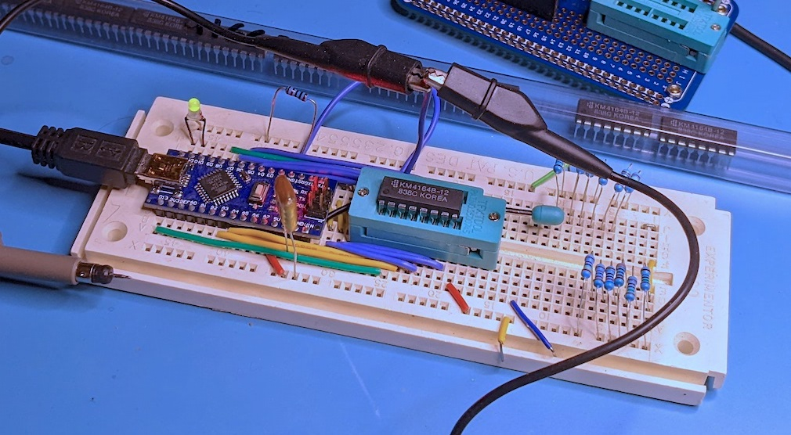
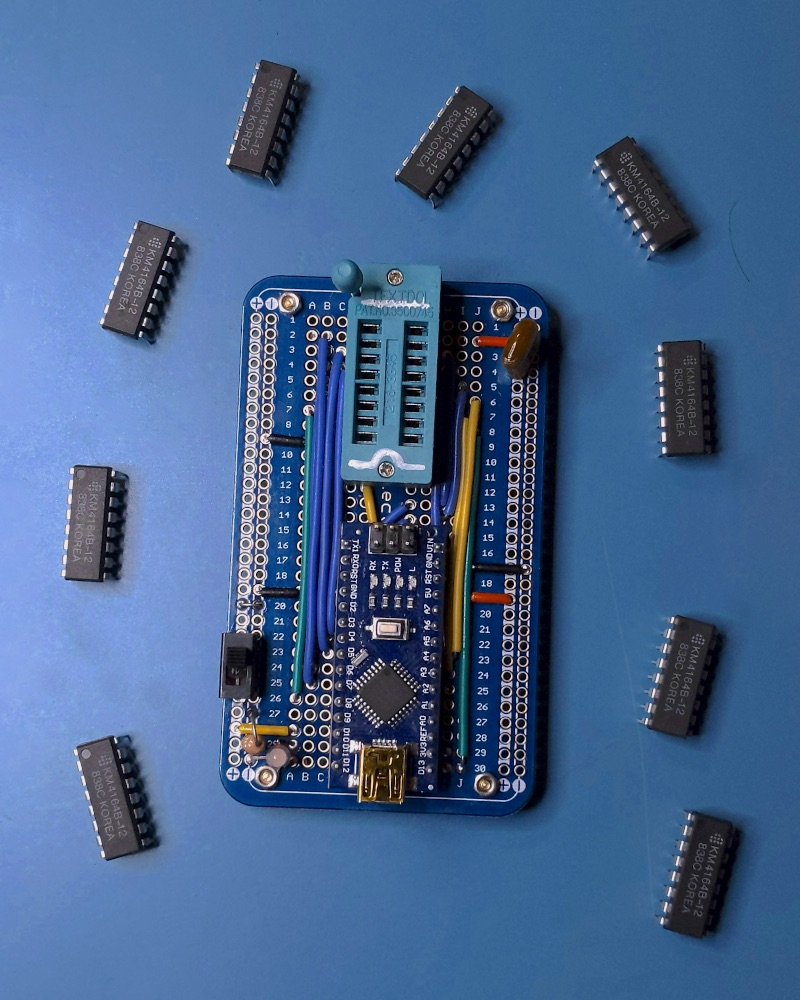
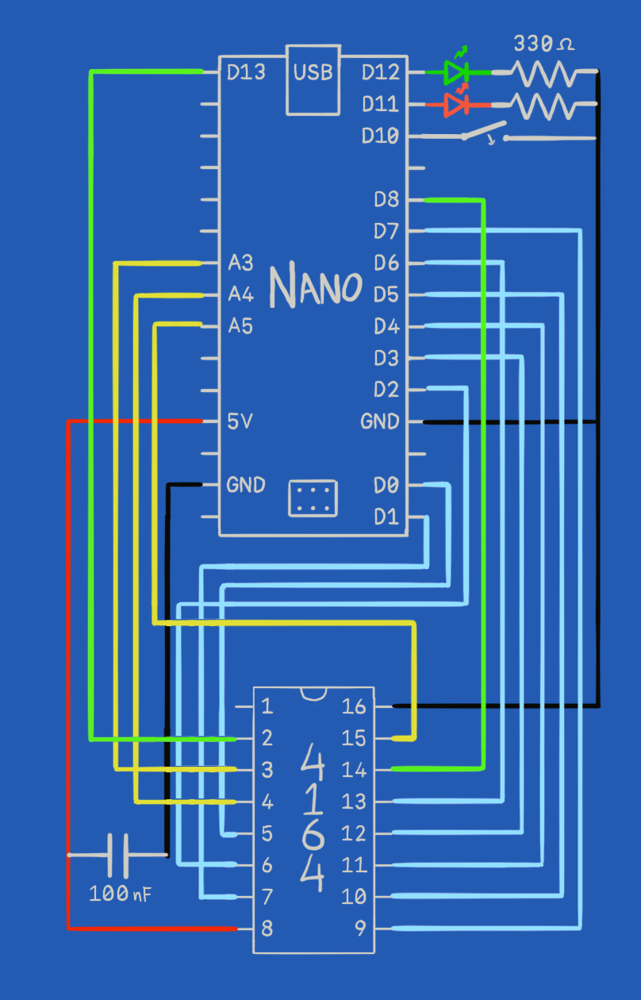

# ATmega DRAM Tester

- Uses standard March C- algorithm to fully test real-world DRAM faults
- Read mode for measuring row access time
- Only requires an Arduino Nano and a ZIF socket

Watch [this video](https://www.youtube.com/watch?v=NkVNLflDXrE) to learn about DRAM testing.





## Using the tester

Disconnect power before inserting or removing chips for test.

In memory test mode (see [Mode Select](#mode-select)), the full test takes around 1 second. If no errors are detected, the green LED will be set and the chip can be considered working. The test repeats in a loop and can be left running to catch intermittent errors. If an error is detected, the red LED will persist until reset even if subsequent tests pass. The Arduino's built-in LED can also be observed flashing (2 long and 1 short per test) as it shares the same pin as the data line.

In access time measurement mode, an alternating pattern is written once and then read in a loop. If read errors are detected, the red LED will be set. The main purpose of the test is for triggering an oscilloscope from `RAS` (Arduino pin A4) and measuring the delay until `Dout` (Arduino pin D8) toggles.

In either mode, the `ERR` pin (Arduino pin A1) can be used for triggering a scope or logic analyzer at all points where an error is detected.

## Assembling the circuit



### Arduino Nano pinout
```
 Din-|PB5 |USB| PB4|-Green LED+
    -|    |___| PB3|-Red LED+
    -|          PB2|-Mode Select
    -|PC0       PB1|-
/ERR-|PC1       PB0|-Dout
 /RE-|PC2       PD7|-A7
 /WE-|PC3       PD6|-A6
/RAS-|PC4       PD5|-A5
/CAS-|PC5       PD4|-A4
    -|          PD3|-A3
    -|          PD2|-A2
  5V-|5V        GND|-GND
    -|             |-
 GND-|GND  ...  PD0|-A0
    -|     ...  PD1|-A1
```

`/RE` and `/ERR` aren't connected to DRAM, but provide test points for triggering a scope on read cycles and error conditions.

#### Mode Select
- SPST switch between `Mode Select` and `GND`
- Set open to select march C- test
- Set closed to select access time measurement

### 4164 pinout
```
 (A8)-|1  \/ 16|-GND
  Din-|2     15|-CAS
   WE-|3     14|-Dout
  RAS-|4     13|-A6
   A0-|5     12|-A3
   A2-|6     11|-A4
   A1-|7     10|-A5
   5V-|8      9|-A7
```

41128 and 41256 DRAMs add `A8` (not currently supported)

NOTE only `CAS` and `A0-A2` cross the center line if the Nano and 4164 are aligned as above. This simplifies the layout on a breadboard or protoboard.

## Building the software

Use the [PlatformIO](https://platformio.org/) plugin for [VSCode](https://code.visualstudio.com/).

Open the project folder with VSCode, select the environment for your board (`nano`, `oldnano`, `uno`), and click `Upload`.

See [this video](https://www.youtube.com/watch?v=nlE2203Q3XI) for help building with PlatformIO.

Distributed under the [MIT license](LICENSE.txt)
